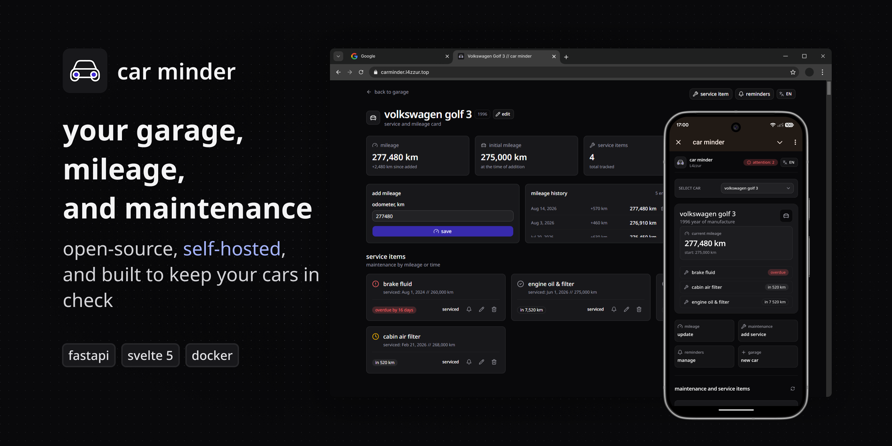

<p align="center">
  
</p>

# car minder


**your garage, mileage, and maintenance**  
open-source, self-hosted, and built to keep your cars in check

**English** • [Русский](README_RU.md)

[Screenshots](docs/SCREENSHOTS.md) •
[Features](#features) •
[Quick Start](#quick-start) •
[Configuration](#configuration) •
[Tech Stack](#tech-stack) •
[Development](#development) •
[Contributing](#contributing) •
[License](LICENSE)

---

**car minder** is an open-source, self-hosted web app and Telegram companion for your garage. It helps you keep a clean digital service book, log odometer readings, and receive timely reminders when your car is due for fresh oil, new parts, or routine maintenance.

## Features

- **Garage**: Add your cars (make, model, year) and track their current mileage.
- **Service book**: Set maintenance intervals for parts and fluids by kilometers, days, or both.
- **Status badges**: Visual `OK`, `SOON`, and `DUE` tags showing what needs attention.
- **Mileage logs**: Record new odometer readings anytime to keep your mileage up to date.
- **Telegram notifications**: Get alerts when service is due, with an inline button to mark it done.
- **Mileage prompts**: The bot asks for your current odometer reading if you haven't updated it in a while.
- **Telegram Mini App**: Fast mobile UI inside Telegram to check your cars and log mileage.
- **Self-hosted**: Runs in a single Docker container with SQLite — no extra databases or services.

## Quick Start

### 1. Docker Compose (Recommended)

You don't need to clone the repository to run car minder. Create a directory on your server and grab the configuration files:

```bash
mkdir car-minder && cd car-minder
curl -O https://raw.githubusercontent.com/L4zzur/car-minder/main/docker-compose.yml
curl -O https://raw.githubusercontent.com/L4zzur/car-minder/main/.env.template
cp .env.template .env
```

Generate a secure secret key and set `APP__AUTH__SECRET_KEY` in your `.env`:

**Option A (OpenSSL):**

```bash
openssl rand -hex 32
```

**Option B (Python):**

```bash
python3 -c "import secrets; print(secrets.token_hex(32))"
```

Start the application:

```bash
docker compose up -d
```

The web application will be available at [http://localhost:8000](http://localhost:8000). Your SQLite database and files are stored in the `./data` directory next to `docker-compose.yml`.

### 2. Updating

To pull the latest release:

```bash
docker compose pull
docker compose up -d
```

## Configuration

car minder uses environment variables with the `APP__` prefix:

| Variable                                 | Description                                                             | Default                          |
| :--------------------------------------- | :---------------------------------------------------------------------- | :------------------------------- |
| `APP__MODE`                              | Application mode (`prod` or `dev`)                                      | `prod`                           |
| `APP__DOMAIN`                            | Public domain name for Telegram webhooks (e.g. `carminder.example.com`) | _None_                           |
| `APP__RUN__HOST`                         | Host interface to bind                                                  | `0.0.0.0`                        |
| `APP__RUN__PORT`                         | HTTP server port                                                        | `8000`                           |
| `APP__API__PREFIX`                       | API route prefix                                                        | `/api`                           |
| `APP__CORS__ORIGINS`                     | JSON list of allowed CORS origins                                       | `["http://localhost:8000", ...]` |
| `APP__DB__FILE_PATH`                     | Path to the SQLite database file                                        | `/app/backend/data/db.sqlite`    |
| `APP__AUTH__SECRET_KEY`                  | Secret key for JWT signing and session security                         | _Required_                       |
| `APP__AUTH__ALGORITHM`                   | JWT signing algorithm                                                   | `HS256`                          |
| `APP__AUTH__ACCESS_TOKEN_EXPIRE_MINUTES` | Access token lifetime in minutes                                        | `10080` (7 days)                 |
| `APP__AUTH__ALLOW_SIGNUP`                | Allow new user registration (`true` / `false`)                          | `true`                           |
| `APP__BOT__TOKEN`                        | Telegram Bot API token from [@BotFather](https://t.me/BotFather)        | _Optional_                       |
| `APP__BOT__WEBHOOK_SECRET`               | Secret token to verify incoming Telegram webhooks                       | _Optional_                       |

## Tech Stack

- **Backend**: [FastAPI](https://fastapi.tiangolo.com/) (Python 3.13), [SQLAlchemy 2.0](https://www.sqlalchemy.org/) Async, [SQLite](https://www.sqlite.org/) (`aiosqlite`), [APScheduler](https://apscheduler.readthedocs.io/)
  - _Tooling_: [uv](https://docs.astral.sh/uv/), [Ruff](https://docs.astral.sh/ruff/), [ty](https://github.com/bndr/ty), [Alembic](https://alembic.sqlalchemy.org/), [Pytest](https://pytest.org/)
- **Frontend**: [Svelte 5](https://svelte.dev/) (Runes), [SvelteKit](https://kit.svelte.dev/), [Tailwind CSS v4](https://tailwindcss.com/), [shadcn-svelte](https://shadcn-svelte.com/)
  - _Tooling_: [pnpm](https://pnpm.io/), [Vite](https://vite.dev/), [ESLint](https://eslint.org/), [Prettier](https://prettier.io/)
- **Telegram**: [aiogram 3](https://aiogram.dev/) (Webhook bot), [@tma.js/sdk-svelte](https://github.com/Telegram-Mini-Apps/tma.js) (Telegram Mini App)
- **Deployment**: [Docker](https://www.docker.com/), Docker Compose

## Development

### Prerequisites

- [uv](https://docs.astral.sh/uv/) (Python package manager)
- [pnpm](https://pnpm.io/) (Node.js package manager)
- Node.js 20+

### Backend

```bash
cd backend
uv sync
uv run alembic upgrade head
uv run uvicorn main:app --reload --port 8000
```

Run test suite:

```bash
uv run pytest
```

### Frontend

```bash
cd frontend
pnpm install
pnpm dev
```

Type checking:

```bash
pnpm check
```

## Contributing

Contributions, bug reports, and suggestions are always welcome!

### Adding Translations

car minder supports multiple languages out of the box:

- **Frontend UI**: Localized using Paraglide JS in `frontend/messages/`.
- **Telegram Bot**: Localized using Fluent files in `backend/app/bot/locales/`.

If you would like to help translate car minder into your language or fix existing translations, feel free to open a pull request!

## License

car minder is licensed under the [MIT License](LICENSE). You are free to use, modify, and distribute this software for personal or commercial purposes. However, if you make an enhancement for it, please consider sending a pull request to share it with the community.
