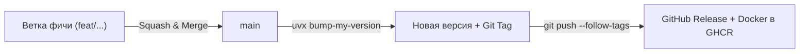

# Release & Development Workflow

Краткое руководство по разработке, версионированию и публикации релизов.

---

## 1. Модель веток (Trunk-Based)

Ветки `dev` / `develop` **нет**. 
- **`main`** — единственный источник правды. Всегда содержит стабильный рабочий код.
- **Ветки фич/фиксов** (`feat/...`, `fix/...`) — создаются от `main`, вливаются в `main` через PR (Squash and merge), после чего удаляются.

---

## 2. Правило коммитов (Conventional Commits)

В процессе разработки делай сколько угодно коммитов. 
При слиянии ветки в `main` используй **Squash and merge** с понятным заголовком:

| Префикс | Назначение | Пример |
|---|---|---|
| `feat:` | Новая функциональность | `feat: add pdf export for service records` |
| `fix:` | Исправление бага | `fix: resolve double mileage calculation` |
| `perf:` | Оптимизация производительности | `perf: speed up car list loading` |
| `refactor:` | Рефакторинг без изменения логики | `refactor: extract reminder logic to service` |
| `chore:` | Рутина, обновление зависимостей | `chore: update dependencies` |

> 💡 Из этих заголовков GitHub автоматически формирует **Changelog** при релизе.

---

## 3. Инструкция по шагам



### Шаг 1. Разработка фичи
```bash
# 1. Всегда начинаем от чистого актуального main
git checkout main
git pull --ff-only

# 2. Создаем ветку под задачу
git checkout -b feat/my-new-feature

# 3. Работаем, коммитим...
git push -u origin feat/my-new-feature

# 4. Создаем PR через GitHub CLI (или через браузер):
gh pr create --fill
```
Создай Pull Request в GitHub и влей в `main` через **Squash and merge** (или одной командой `gh pr merge --squash --delete-branch`). Полная шпаргалка: [docs/GITHUB_CLI.md](file:///f:/repos/car-minder/docs/GITHUB_CLI.md).

После слияния PR на GitHub:
```bash
# Синхронизируем локальный main и удаляем смердженную ветку
git checkout main
git pull --ff-only
git branch -d feat/my-new-feature
```

> ⚠️ **Что делать, если локальный `main` разошелся с GitHub (появился лишний Merge commit):**
> Не делай `git pull` с созданием мержа. Просто сбрось локальный `main` в состояние origin:
> ```bash
> git fetch origin
> git reset --hard origin/main
> ```

### Шаг 2. Выпуск релиза
Когда накопились нужные изменения в `main` и пора выкатить обновление:

```bash
git checkout main
git pull

# Для багфикса (0.1.0 -> 0.1.1):
uvx bump-my-version bump patch

# Для новой фичи (0.1.0 -> 0.2.0):
uvx bump-my-version bump minor

# Для мажорного релиза с ломающими изменениями (0.1.0 -> 1.0.0):
uvx bump-my-version bump major
```

### Шаг 3. Публикация
```bash
git push --follow-tags
```

---

## 4. Что происходит автоматически после пуша тега
1. GitHub Actions собирает multi-arch Docker-образ (`linux/amd64`, `linux/arm64`).
2. Пушит в `ghcr.io/L4zzur/car-minder:<version>` и `ghcr.io/L4zzur/car-minder:latest`.
3. Создаёт GitHub Release со структурированным списком изменений (Changelog).

---

## 5. Как обновляется пользователь
```bash
docker compose pull
docker compose up -d
```
